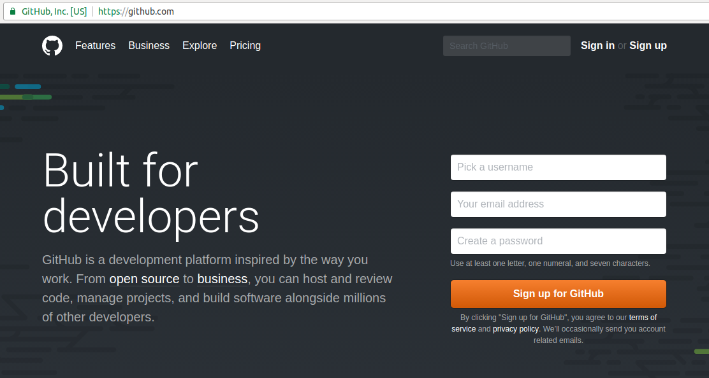
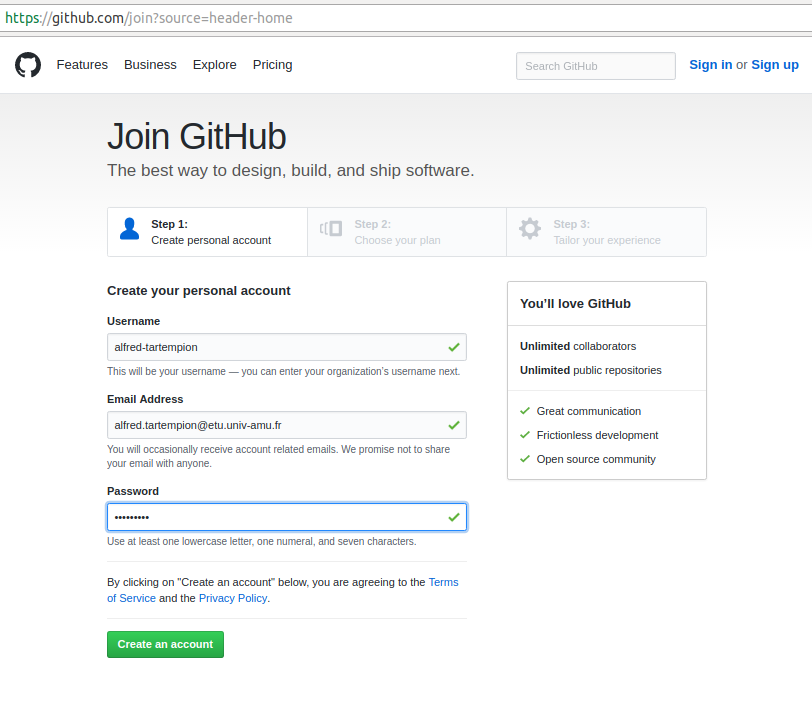
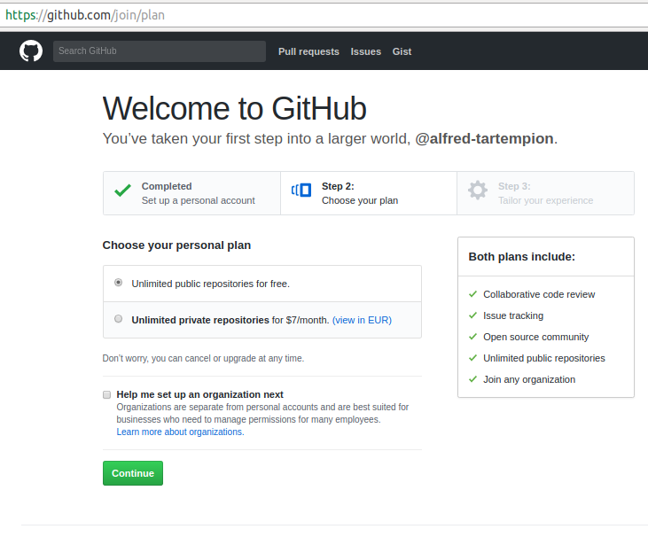
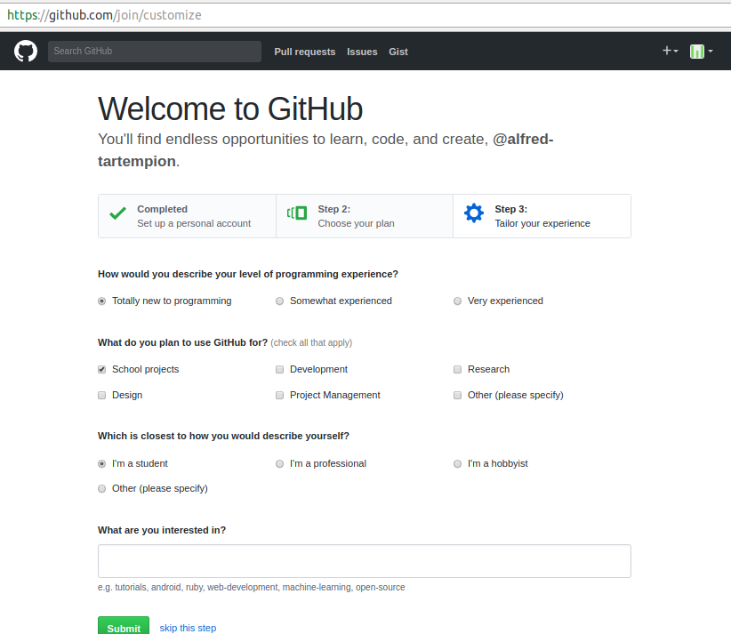
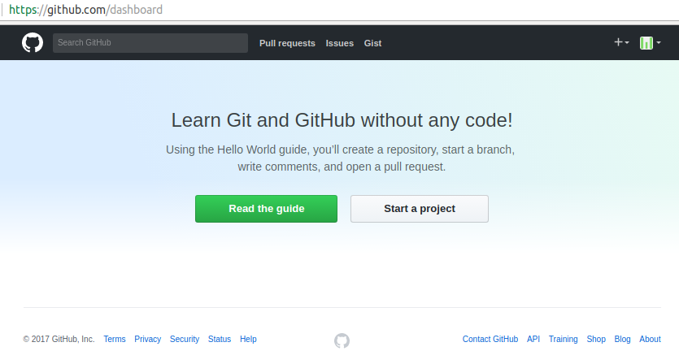

#  Introduction aux IHM en Java 

### IUT d’Aix-Marseille – Département Informatique Aix-en-Provence

* **Cours:** [M2105](http://cache.media.enseignementsup-recherche.gouv.fr/file/25/09/7/PPN_INFORMATIQUE_256097.pdf)
* **Responsable:** [Sébastien NEDJAR](mailto:sebastien.nedjar@univ-amu.fr)
* **Enseignants:** [Sébastien NEDJAR](mailto:sebastien.nedjar@univ-amu.fr), [Cyril Pain-Barre](mailto:cyril.pain-barre@univ-amu.fr)
* **Besoin d'aide ?**
    * La page [Piazza de ce cours](piazza.com/univ-amu.fr/spring2017/m2105/home).
    * Consulter et/ou créér des [issues](https://github.com/IUTInfoAix-M2105/tp1/issues).
    * [Email](mailto:sebastien.nedjar@univ-amu.fr) pour une question d'ordre privée, ou pour convenir d'un rendez-vous physique.

## TP 1 : Découverte de l'environnement de travail, des outils et premiers programmes en Java 

L'objectif premier de ce TP est de vous familiariser avec tous les nouveaux outils qui seront mis en oeuvre pendant ce cours. En plus de la réalisation d'IHM, ces TP seront la première occasion de se confronter à la gestion de version, au test unitaire et à des outils de gestion de cycle de vie logiciel comme Maven.

### Préparation de l'environnement

Comme vous allez le découvrir, pour conserver vos réalisations et permettre à votre enseignant de suivre votre avancement vous allez apprendre versionner votre travail sur [github](https://github.com/). Pendant ce module, vous allez principalement écrire du code pour vous-même. Comme vous le verrez plus tard ça sera principalement sur les projets à plusieurs que [Git](https://git-scm.com/) offrira sa tout son potentiel.

#### Création d'un compte Github

Rendez-vous sur la page d'accueil de [github](https://github.com/) :

Dans le coin supérieur droit cliquer sur "Sign Up". Dans la page qui apparait, inscrivez votre nom d'utilisateur (il doit être composé de votre prénom et de votre nom spéparé par le caractere '-'). 
Dans le champs "Email Adress" mettre votre adresse universitaire (important pour bénéficier des avantages liés à votre statut d'étudiant). 

Une fois le mot de passe renseigné cliquer sur le bouton "Create Account". Sur l'écran suivant, vous n'avez rien à changer et pouvez directement cliquer sur "Continue".

Le troisième et dernier écran d'enregistrement vous demande des informations sur votre profil. Indiquer principalement que vous êtes un étudiant et que vous comptez utiliser github pour des projets étudiants.

Une fois ces informations renseignées vous pouvez cliquer sur "Submit" pour définitivement créer votre compte.

#### Paramétrage de votre compte Github

#### Configuration et prise en main de Git

#### Import du projet dans l'IDE

#### Workflow
?????